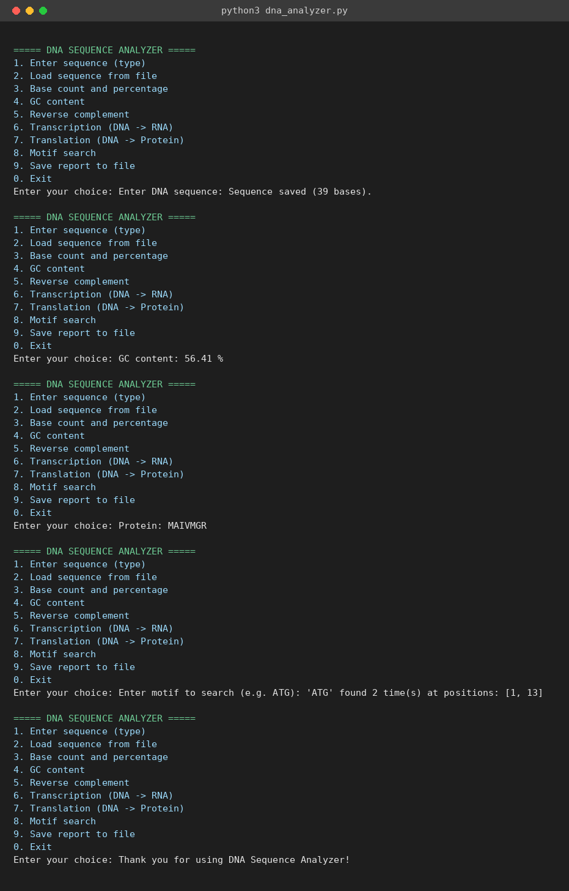

# DNA Sequence Analyzer

## About the project

This is a Python program I made for my course project. It takes a DNA sequence (either typed in or loaded from a file) and lets you run different kinds of analysis on it from a menu, like counting bases, checking GC content, getting the reverse complement, converting it to RNA, translating it into a protein, and searching for a motif.

I built the codon table using two strings instead of typing out all 64 codons by hand, which was a nice shortcut I found while working on it.

## What it can do

- Type in a DNA sequence directly, or load one from a text/FASTA file
- Checks that the sequence only has A, T, G, C before using it
- Counts each base and shows the percentage
- Calculates GC content
- Gives the reverse complement
- Converts DNA to RNA (transcription)
- Translates DNA into a protein using a codon table, stopping at a stop codon
- Searches for a motif (like ATG) and shows where it occurs
- Saves a full report to report.txt

## Tools used

- Python 3, no external libraries
- VS Code
- Git and GitHub

## How to run it

1. Make sure Python 3 is installed (`python --version`)
2. Download or clone the repo
3. Open a terminal in the project folder
4. Run `python dna_analyzer.py`
5. Pick option 1 to type a sequence, or option 2 to load one from a file
6. After that, pick any of the other options to run an analysis on it
7. Option 0 exits

## How to test it

I tested it manually with a few different sequences. Some things to try:

- Enter a sequence with a lowercase letter, e.g. `atgcgt`, it should still work since it converts to uppercase
- Enter a sequence with an invalid character like `ATGX`, it should give an error
- Try option 3, 4, 5, 6, 7 on a valid sequence and check the numbers make sense
- Try option 8 with a motif and check the positions it gives
- Try running an option before entering a sequence (like pressing 3 first), it should ask you to enter a sequence first
- Try option 2 with a file name that doesn't exist, it should say file not found

## Sample run

A real run of the program, entering a sequence and trying a few options:

## Things that don't work well yet

- If the codon table doesn't reach a stop codon before the sequence ends, translation just stops when it runs out of full codons, there's no warning about that
- No option to remove an existing sequence and start over except by entering a new one
- No automated tests yet, only manual testing
- Error handling for the file loading option is basic

More details are in `statement.md`.
